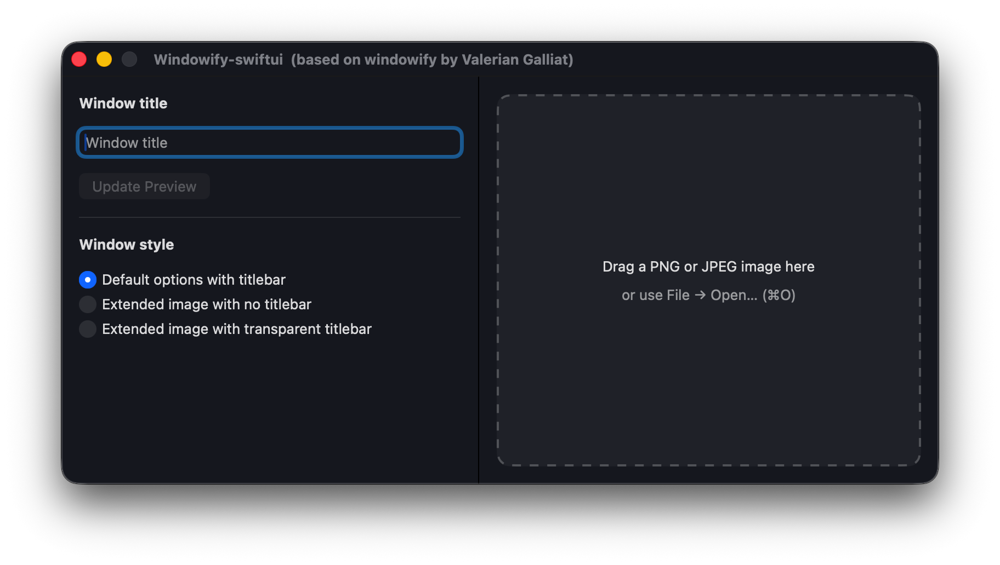
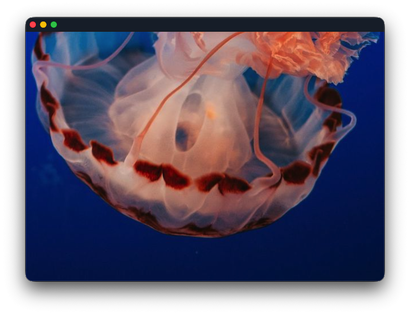
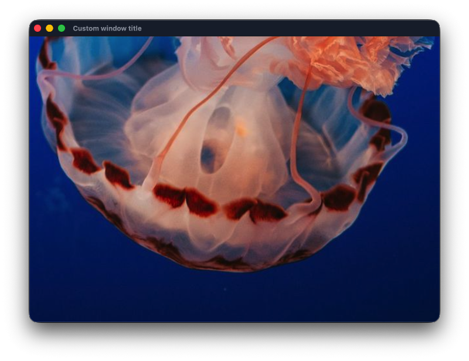
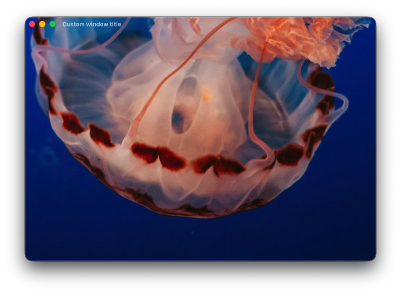

# 🚥 Windowify-swiftui

> Open a picture as a configurable macOS-style window using a SwiftUI desktop app.

## Requirements

- Swift 5
- Xcode 15+
- macOS 13+

## How to use

1. Build and run the app from Xcode or get it from the releases page. 
2. Load a PNG/JPG image by:
   - dragging the file onto the main window, or
   - using **File → Open…** (`⌘O`).
3. Use the title field to set the window title (optional).
4. Choose a window style from the three options:
   - **Default options with titlebar** — standard window with close, minimise, and resize buttons.
   - **Extended image with no titlebar** — borderless window where the image fills the entire frame.
   - **Extended image with transparent titlebar** — standard window buttons with the image extending behind a transparent titlebar.
5. Click **Update Preview** after changing the title or style to refresh the preview window.
6. Press **⌘W** while the preview window is focused to close just that preview window.

## Example

Using this picture as example:

 

**1.-** Default options with titlebar (close, minimise, and resize buttons)

**2.-** Adding a title to the text box

**3.-** Extended image with no titlebar: image fills the entire window frame

**4.-** Extended image with transparent titlebar: standard buttons with the image extending behind a transparent titlebar

## Project structure

- `Windowify-swiftui/App/` contains the app entry point, commands, and app delegate.
- `Windowify-swiftui/Models/` contains shared model types such as `WindowAttributes`.
- `Windowify-swiftui/ViewModels/` contains image loading and preview-window logic.
- `Windowify-swiftui/Views/` contains the SwiftUI views split into smaller components.
- `Windowify-swiftui/Languages/` contains the English and Spanish localizable files.

---

# ❖ Credits

**Valerian Galliat** is the author of the [windowify](https://github.com/valeriangalliat/windowify) project, a command-line tool written in Swift. I really liked this project when I found it while searching for an app or tool that does exactly what windowify does.

I've tried to port the original project (command-line tool) to a graphical application written in SwiftUI. The functionality is basically the same, but the goal has been to create a user-friendly interface that avoids entering commands in the Terminal.

## Why?

The reason [Valerian Galliat](https://github.com/valeriangalliat) initially developed that was to fake a screenshot of a
macOS dialog with the native transparent shadow. See his
[blog post](https://www.codejam.info/2023/04/macos-screenshot-dialog.html)
for details!

---

# ⌽ Xcode console messages

I have not been able to completely remove messages from the Xcode console related to `com.apple.linkd.autoShortcut`. 

`com.apple.linkd.autoShortcut` is a macOS system XPC service used when the system tries to discover or register App Intents / App Shortcuts metadata for an app. When that service is unavailable, macOS prints connection errors like the ones above. They are usually harmless, but they add noise to the console.

These messages, however, are not seen in the macOS Console or if Windowify-swiftui is launched from Terminal with the command:

`/Applications/Windowify.app/Contents/MacOS/Windowify`

Any feedback will be very welcome.
